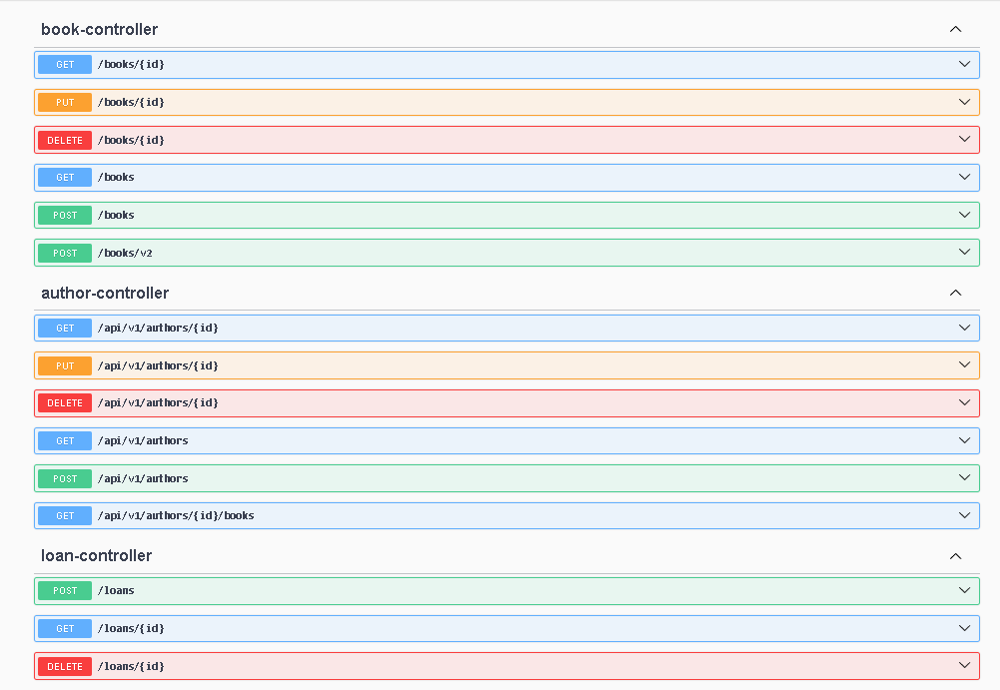

# Induviduell inlämnings uppgift som handlar om Bibliotek backend system

Denna pojektet byggs för att bevisa mina kunskaper inom backend arhiktektur. För att följa enklare genom mitt arbete jag har skapat kommits enligt delar i uppgifter.

Projekten handlar om ett enklare bibliotek system med endast backend delen. Biblioteken har funktionalitet av att skapa böcker, författare samt lån. Jag använder mig av SpringBoot versionen 3.0.5. och Java 21. 

# Hur fungerar programmet

När main funktionen körs och pragrammet är i gång så finns det här i README längst ner två länkar vilka man kan följa för att kunna testa systemet. 

Den första öppnar H2 Databas vilken låter dig som användare se vad som finns i data basen och hur olika tabeller ser ut. 

Den andra länken öppnar swagger some är väldigt enkel api kontroller. Hur fungerar swagger? I bilden nedan ser vi olika anrop som användare kan få göra.
- book-controller:
    - GET anrop | söker efter bok med specifik id
    - PUT anrop | söker efter bok med specifik id och låter dig mata in nya attributer
    - DELETE anrop | söker efter bok med specifik id och raderar den
    - GET anrop | en till GET anrop som låter använder få se på alla böcker
    - POST anrop | här matar användare in attributer för att skapa bok av version ett
    - POST anrop | här matar användare in attributer för att skapa bok av version två

- author-controller
    - GET anrop | söker efter author med specifik id
    - PUT anrop | söker efter author med specifik id och låter användare ändra på namnet
    - DELETE anrop | söker efter author med specifik id och låter användare ta bort den (Funderar om alla böcker är först borttagna)
    - GET anrop | söker efter alla authors
    - POST anrop | här matar användare in attributer för att söka en author
    - GET anrop | söker efter author med specifik id för att visa alla böcker han har skrivit

- loan-controller
    - POST anrop | låter användare mata in ID av en bok som hen vill låna och sätter tiden lånet har gjorts
    - GET anrop | söker efter lån med specifik id
    - DELETE anrop | söker efter lån med specifik id och tar bort den

## För att öppna H2 Databas

http://localhost:8080/h2-console

## För att öppna swagger

http://localhost:8080/swagger-ui.html
